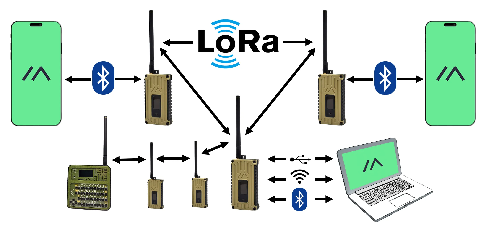

import { LinkButton, Aside } from "@astrojs/starlight/components";

Este sitio es un proyecto comunitario creado por voluntarios y entuciastas de la comunidad de Meshtastic en Colombia. Su objetivo es proporcionar documentación, guías y recursos para ayudar a los usuarios a comprender y utilizar la red Meshtastic en Colombia de manera fácil y efectiva.

## ¿Qué es Meshtastic?

Es un proyecto de código abierto que permite el uso de dispositivos de radio LoRa de bajo costo, como una plaraforma de comunicación de largo alzance en áreas sin covertura de telecomunicaciones.

_Ejemplo de topología de una red Meshtastic. Imagen: Meshtastic.org_

#### Características

- Largo alcance
- No necesita un télefono para la comunicación en malla
- Comunicación descentralizada - No se requiere un router dedicado
- Comunicación encriptada
- Excelente vida de batería - Bajo consumo
- Envía y recibe mensajes de texto entre miembros de la malla
- Funcionalidades de ubicación GPS opcionales
- y mucho más...

## ¿Qué es Meshtastic Colombia Community?

Somos una comunidad creciente de usuarios, entusiastas y radioaficionados trabajando juntos para construir una red de comunicación robusta y confiable en Colombia. Nuestro objetivo es facilitar el acceso a la tecnología Meshtastic y promover su uso en diversas aplicaciones, desde actividades al aire libre hasta situaciones de emergencia usando dispositivos LoRa de muy bajo costo. Operan en la frecuencia de 915 MHz, que es de uso libre en Colombia, estos dispositivos están cargados con el firmware Meshtastic y se conectan automáticamente entre sí.

Nuestra comunidad se basa en la colaboración y el intercambio de conocimientos, y estamos comprometidos a proporcionar recursos útiles para todos los interesados en Meshtastic.

Meshtastic no requiere que tengas una licencia de radioaficionado ya que opera en frecuendias de uso libre en Colombia, lo que lo hace accesible para todos, esto también significa que puede ser usada con cifrado o encriptacieon de mensajes, lo que la hace ideal para situaciones donde la privacidad y la seguridad son importantes.

## ¿Cómo empezar?

<Aside title="En construcción..." type="caution">Asegurate de revisar nuestra página de [errores a evitar](/configuracion/evita-fallas) para prevenir posibles fallas.</Aside>

1. Adquiere un dispositivo LoRa compatible con Meshtastic. Puedes consultar la lista de [dispositivos compatibles](https://meshtastic.org/docs/hardware/devices/).
2. [Flashea tu hardware](https://flasher.meshtastic.org/) con el firmware Meshtastic.
3. Descarga la aplicación Meshtastic en tu teléfono móvil. Está disponible para [Android](https://play.google.com/store/apps/details?id=com.geeksville.mesh) e [iOS](https://apps.apple.com/us/app/meshtastic/id1586432531).
4. Configura tu dispositivo siguiendo nuestra guía de [configuración](/configuracion/configuracion-nodos/).
5. (opcional) Date de alta en la [lista de usuarios y zonas](https://docutopia.sustrato.red/MeshtasticCO:PersonaUbicaciones). Solo pon tú zona y tú nickname
6. Únete a nuestra comunidad en WhatsApp o Telegram para interactuar con otros usuarios, hacer preguntas y compartir tus experiencias.

<LinkButton href="https://chat.whatsapp.com/Bkw5MiV8RqVL6GRutNyZNS?mode=ac_c">
  Únete al grupo de WhatsApp
</LinkButton>

<LinkButton href="https://t.me/meshtasticco">
  Únete al grupo de Telegram
</LinkButton>

## Contribuir

Si deseas contribuir a esta comunidad, puedes hacerlo de varias maneras:

- **Creando nuevo contenido**: Si tienes experiencia con Meshtastic y deseas compartir guías, tutoriales o cualquier otro recurso, puedes dejar tus aportes para la comunidad.
- **Reportando errores**: Si encuentras algún error en la documentación o en el sitio, por favor, infórmanos para que podamos corregirlo.
- **Sugerencias**: Si tienes ideas para mejorar el contenido o la estructura del sitio, no dudes en compartirlas.
- **Participando en la comunidad**: Únete a nuestro grupo de WhatsApp para interactuar con otros usuarios, hacer preguntas y compartir tus experiencias.

<LinkButton href="/comunidad/contribuir/">
  Contribuir
</LinkButton>
