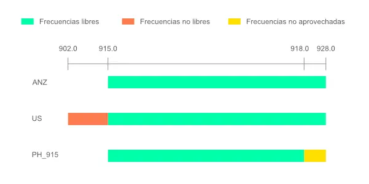

import { LinkCard, CardGrid, Aside } from '@astrojs/starlight/components';

## Configuración inicial

- Conecta la antena al dispositivo.
- Enciende el dispositivo.
    - Cada modelo de dispositivo tiene su propia combinación de botones. Verifica el manual de tu dispositivo.
- Configura la comunicacieon con el dispositivo.
    - Habilita el Bluetooth en tu dispositivo (si aun no está habilitado).
    - Ó usa WiFi si tu dispositivo tiene un chip de WiFI.
    - Cable USB usando `https://client.meshtastic.org/` es otra opción. Po favor ten presente que WebSerial no es compabible con Firefox o Safari. Te recomendamos usar Google Chrome o Microsoft Edge.

## Ajustes de configuración

- Una vez conectado, podrás acceder a la configuración a través de la aplicación móvil o del cliente web.
- Para acceder a la interfaz web, navega a la dirección IP que se muestra en la aplicación Meshtastic o ingresa por la URL: http://meshtastic.local
- Configuración básica:
    - Introduce el nombre de tu dispositivo.
    - Selecciona la región correcta (en este caso, selecciona **Australia y Nueva Zelanda** para 915 MHz. En algunos dispositivos aparece como **Slot: 20**).
    - Configura otras preferencias, como la configuración del GPS, el brillo de la pantalla, etc.
    - Consulta nuestra [configuración recomendada](#otros-ajustes-recomendados).

#### El rol del nodo es un paso importante en la configuración de tu dispositivo Meshtastic.

- Para la mayoría de los nodos, recomendamos el rol `Cliente`. Este es el rol "predeterminado" y proporciona acceso a todas las funciones.
- `Cliente_Mudo` es una buena opción para nodos adicionales, especialmente aquellos muy próximos (por ejemplo, una casa o apartamento) o áreas con alta cobertura de malla. Estos nodos pueden enviar y recibir mensajes, pero no participan en el enrutamiento de los mensajes de otros nodos. No contribuyen a la malla, ni tampoco a la sobrecarga de red que supone tener varios nodos en un área muy pequeña retransmitiendo un mismo mensaje a la vez.
- **Los roles de `Enrutador` o `Repetidor` solo deben usarse para dispositivos con una ubicación excepcional y una excelente línea de visión**. Demasiados enrutadores/repetidores pueden degradar el rendimiento de la red de malla.
- Existen otros roles para nodos que tienen una función distinta a la mensajería.
- Para obtener información detallada sobre todos los roles y su uso, consulta [esta entrada del blog de Meshtastic](https://meshtastic.org/blog/choosing-the-right-device-role/) y la [tabla de roles de Meshtastic](https://meshtastic.org/docs/configuration/radio/device/#roles).

## Otros ajustes recomendados

<Aside type="tip" title="Tip">Si tu quieres, agrega `MeshColombia.co` o `MeshColombia` al nombre de tu nodo, por ejemplo: **`(NOMBRE_DEL_NODO) MeshColombia.co`**, para ayudar a promover la comunidad.</Aside>

|Parametro|Valor|
|---|---|
|Región|`ANZ` (Australia / Nueva Zelanda) ([¿Por qué esta región?](#por-que-usamos-anz))|
|Slot de frecuencia|`20`|
|Número de saltos|`7`|
|Configuración de la onda|`LongFast`|
|Transmisión de radio|`Habilitada`|
|Potencia máxima de transmisión|`30dBm`|
|Sobrescribir el ciclo de trabajo|`Habilitado`|
|Ganancia de recepción aumentada|`Habilitada`|
|Almacenamiento y reenvío|Nodos móviles: `Deshabilitado`, Nodos enrutadores y fijos: `Habilitado`|
|Latido (Heartbeat)|`Habilitado`|
|Número de registros|`100`|
|Número máximo de registros retornados del historial|`100`|
|Ventana de retorno del historial|`7200 segundos` (2 horas)|
|Intervalo de actualización|`900 segundos` (15 minutos)|
|MQTT|`mqtt.meshtastic.org`|
|MQTT Usuario|`meshdev`|
|MQTT Contraseña|`large4cats`|
|MQTT Root Topic|`msh/CO`|
|Zona horaria|`<-05>5` (Colombia)|
|Intervalo de transmisión del información del nodo|`10800 segundos` (3 horas)|
|GPS para nodos móviles|`Habilitado`|
|GPS para nodos fijos|`Ubicación fija`|
|Modo ahorro de energía|Nodos NO solares: `Deshabilitado`, Nodos solares: `Habilitado`|

<Aside title="Ten presente..." type="note">Los ajustes de región están basados en la normatividad vigente y recomendaciones dadas por la ANE (Agencia Nacional del Espectro), entidad encargada de la planeación, atribución, vigilancia y control del espectro radioeléctrico en Colombia. [Conoce más acerca de estas regulaciones](/recursos/regulacion/).</Aside>

## ¿Por qué usamos la región ANZ (Australia / Nueva Zelanda)?

La región ANZ (Australia / Nueva Zelanda) se utiliza debido a su conformidad con las regulaciones locales y la disponibilidad de espectro para dispositivos que operan en frecuencias de uso libre. Esta región ha sido seleccionada para garantizar un rendimiento óptimo y una menor interferencia en las comunicaciones.

En Colombia el rango de frecuencias de 915 MHz es el más adecuado para dispositivos Meshtastic, ya que se alinea con las normativas de la ANE.

<Aside type="note" title="Tip">Si tu dispositivo no tiene la opción de seleccionar **ANZ (Australia / Nueva Zelanda)**, selecciona **Slot: 20**.</Aside>

#### Comparación de las regiones más comunes para 915 MHz

| Región | Descripción | Rango de frecuencias (MHz) |
|--------|-------------| ---------------------|
| **ANZ** | **Australia / Nueva Zelanda** | **915.0 - 928.0** |
| US | Estados Unidos | 902.0 - 928.0 |
| PH_915 | Filipinas | 915.0 - 918.0 |

_Comparación de frecuencias por región._

Analizando las frecuencias de las regiones previamente mencionadas, se observa que la región **ANZ (Australia / Nueva Zelanda)** es la más adecuada para Colombia ya que se encuentra dentro del rango de frecuencias permitido por la ANE. En cuanto a la región **US (Estados Unidos)**, aunque comparte un rango similar, opera en un rango adicional de `902.0 a 915.0 MHz`, por lo que usaría frecuencias de uso restringido que requieren licencia. Finalmente, la región **PH_915 (Filipinas)** tiene un rango más limitado y no aprovecharía el rango entre 918.0 y 928.0 MHz.

## Guías de configuración

Encuentra a continuación las guías de configuración detalladas para cada sección de tu dispositivo Meshtastic:

<LinkCard
title="Configuración de radio"
description="Ajustes recomendados para la configuración de radio"
href="/configuracion/radio"
/>

<LinkCard
title="Configuración de módulo"
description="Ajustes recomendados para la configuración de radio"
href="/configuracion/modulo"
/>