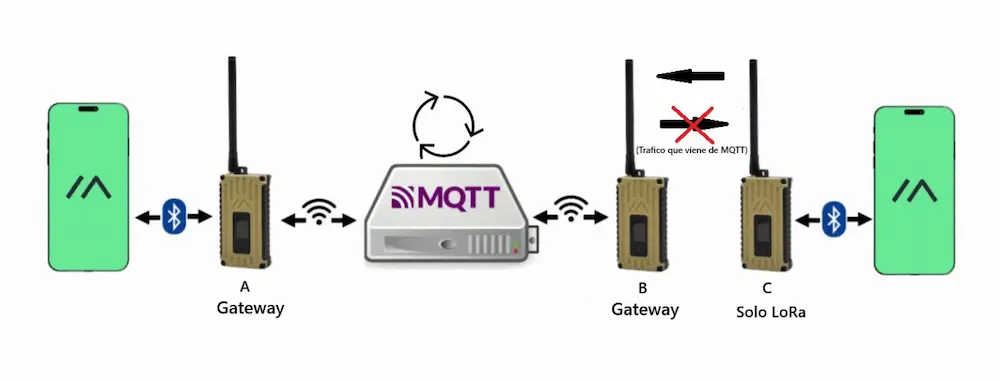
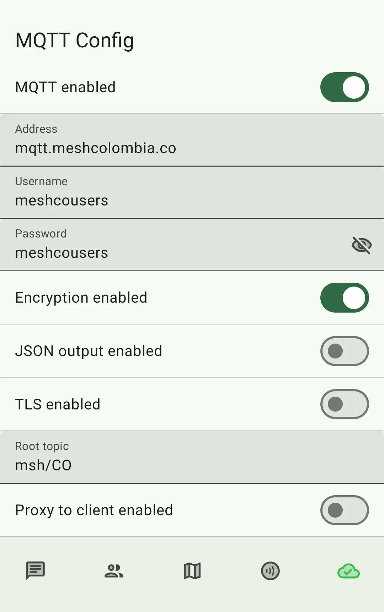
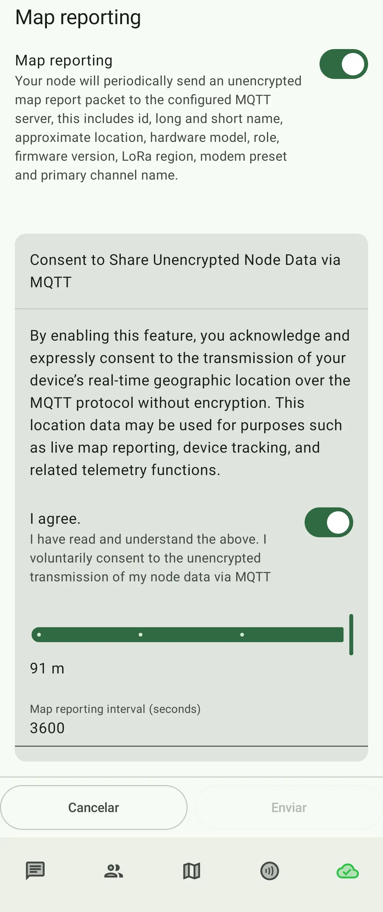

import { Aside, Steps } from '@astrojs/starlight/components';

## ¿Qué es MQTT?

MQTT es la sigla de **Message Queuing Telemetry Transport** o Transporte de Telemetría por Cola de Mensajes. Es un protocolo integrado en Meshtastic que permite a los nodos retransmitir mensajes a través de internet. Esto permite que los nodos conecten donde físicamente no podrían.

### Funcinamiento de MQTT

Canal público **LongFast** (Canal primario) u otro canal secundario con la clave PSK `AQ==`

Los mensajes del `nodo C` son escuchados por el `Gateway B`, publicados en el servidor MQTT y escuchados por el `Gateway A`, y todos los demás Gateways conectados al mismo servidor.

Si algún nodo dentro conectado al servidor MQTT reponde al `nodo C`, este último no podrá escucharlo debido a la política de "Zero Hop" (salto cero).

En otras palabras, los nodos que trabajan solo por **LoRa** puden publicar mensajes en el servidor MQTT pero no pueden recibir mensajes provenientes de este, son sordos a los que allí sucede.

## Configuración de MQTT

Habilitar MQTT te permitirá aparecer en los mapas: [Mapa de nodos de Colombia](https://mapa.meshcolombia.co/), [Mapa de MeshView Colombia](https://meshview.meshcolombia.co/map), entre otros.

1. Ve a la sección de configuración de MQTT y habilitalo.
2. Usa `mqtt.meshcolombia.co` como servidor MQTT.
3. Usa `meshcousers` como nombre de usuario MQTT.
4. Usa `meshcousers` como contraseña MQTT.
6. **Activa** la opción de "Habilitar encriptación".
7. **Desactiva** la opción "Habilitar salida JSON".
5. **Activa** la opción de "Habilitar TLS".
8. Usa `msh/CO` como tema raíz de MQTT (MQTT Root Topic).
9. Si estás usando WiFi, deshabilita la opción `Proxy to Client Enabled`, Si estás usando un teléfono móvil, habilita la opción `Proxy to Client Enabled`.

_Configuración de MQTT._

<Aside type="note">
El tema raíz de MQTT es sensible a mayúsculas y minúsculas. Asegúrate de usar `msh/CO` exactamente como se indica y no dejes espacios en blanco al inicio o al final, ni uses comillas.
</Aside>

<Aside type="tip">
El tema raíz de MQTT es el prefijo que se usa para todos los mensajes MQTT. Por ejemplo, si envías un mensaje a `msh/CO/1234567890`, el tema raíz es `msh/CO`.
</Aside>

10. Ve a la configuración de Canales y luego selecciona el canal primario (LongFast).
11. Establece la llave o "Pre-shared Key" en: `AQ==`
12. Deja el nombre del canal en blanco.
13. Habilita el enlace de subida y deshabilita el enlace de bajada de MQTT.
    - Esto se configura para enviar los mensajes recibidos a MQTT, pero impide que tu nodo reciba mensajes de MQTT. Obtén más información sobre esto en la [configuración opcional](#configuración-opcional).
14. Habilita los informes de mapas (Map Reporting), configura el intervalo de publicación de mapas a 30 segundos o más dependiendo de tu necesidad, y configura la precisión de ubicación deseada.

_Configuración de reporte de ubicación por MQTT._

## Configuración opcional

1. Si usas un dispositivo móvil, asegúrate de habilitar la opción "Conectar a la malla".
2. Puedes cambiar la configuración de enlace de subida y bajada de MQTT según tus preferencias, por ejemplo si deseas contactar con otros usuarios a través de MQTT, deberías habilitar el enlace de bajada también.
3. Te recomendamos tener al menos el enlace de subida habilitado en el canal principal y la posición del dispositivo habilitada para que puedas ver tu ubicación en el mapa de la malla.